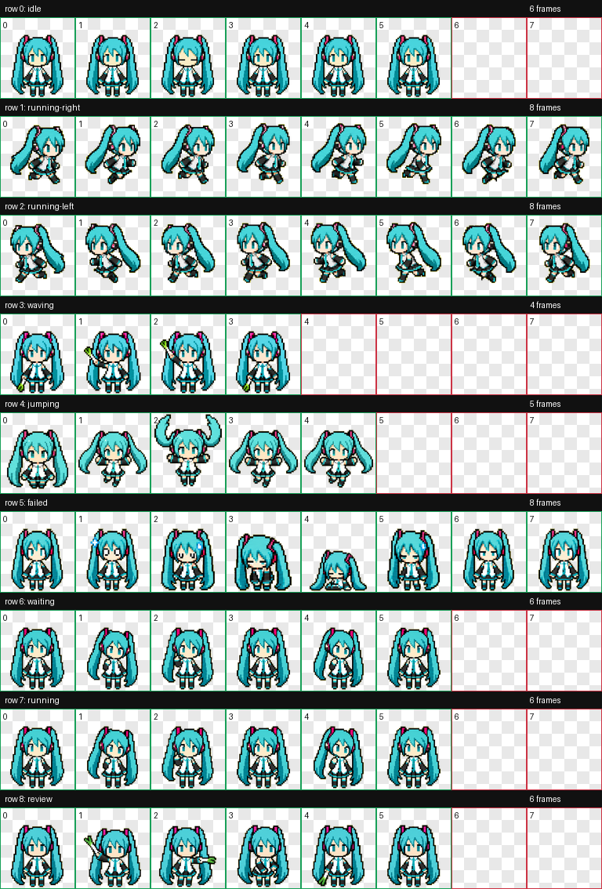

# pixel-39

A pixel styled Codex pet: a tiny blue-green princess with a leek who works with you in Codex and waves when your code is ready.

## Preview



## State Previews

| idle | running-right | running-left |
| --- | --- | --- |
|  |  |  |

| waving | jumping | failed |
| --- | --- | --- |
|  |  |  |

| waiting | running | review |
| --- | --- | --- |
|  |  |  |

## Install

Copy `pets/pixel-39--qing/pet.json` and `pets/pixel-39--qing/spritesheet.webp` into your Codex pets directory:

```text
%USERPROFILE%\.codex\pets\pixel-39\
```

Then select `pixel-39` in Codex. Restart Codex if the pet list does not refresh.

## Character Notes

- Name: `pixel-39`
- Style: pixel styled Codex pet
- Visual identity: blue-green twin-tails, white outfit, magenta headset accents
- Prop: leek, used for presentation/waving states
- Outfit note: white outfit, not gray

## Asset Notice

This repository contains two kinds of material:

- Code and metadata: MIT License. See `LICENSE`.
- Visual assets: fan-made, non-commercial character artwork.

The visual assets are fan-made, non-commercial pixel-art assets inspired by Hatsune Miku / Piapro Characters.

Hatsune Miku, (C) Crypton Future Media, Inc. 2007, is licensed under CC BY-NC 3.0:
https://creativecommons.org/licenses/by-nc/3.0/

Based on a work at:
https://piapro.net/license

This project is not affiliated with, sponsored by, or endorsed by Crypton Future Media, Inc.

Do not use the visual assets for commercial purposes. The MIT license for code and metadata does not grant rights to character designs, trademarks, music, voice, or other third-party assets.
